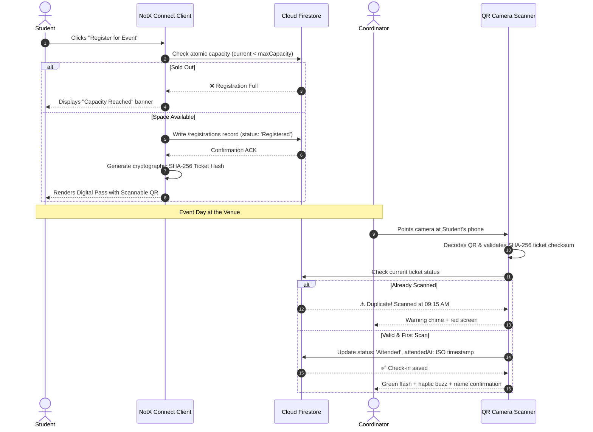

<div align="center">

<pre>
███╗   ██╗ ██████╗ ████████╗██╗  ██╗    ██████╗ ██████╗ ███╗   ██╗███╗   ██╗███████╗ ██████╗████████╗
████╗  ██║██╔═══██╗╚══██╔══╝╚██╗██╔╝   ██╔════╝██╔═══██╗████╗  ██║████╗  ██║██╔════╝██╔════╝╚══██╔══╝
██╔██╗ ██║██║   ██║   ██║    ╚███╔╝    ██║     ██║   ██║██╔██╗ ██║██╔██╗ ██║█████╗  ██║        ██║
██║╚██╗██║██║   ██║   ██║    ██╔██╗    ██║     ██║   ██║██║╚██╗██║██║╚██╗██║██╔══╝  ██║        ██║
██║ ╚████║╚██████╔╝   ██║   ██╔╝ ██╗   ╚██████╗╚██████╔╝██║ ╚████║██║ ╚████║███████╗╚██████╗   ██║
╚═╝  ╚═══╝ ╚═════╝    ╚═╝   ╚═╝  ╚═╝    ╚═════╝ ╚═════╝ ╚═╝  ╚═══╝╚═╝  ╚═══╝╚══════╝ ╚═════╝   ╚═╝
</pre>

<h3>⚡ THE ZERO-BS CAMPUS EVENT & ASSOCIATION PLATFORM ⚡</h3>

<p>
<b>Cryptographic QR Passes • Instant Camera Check-In • Verified Digital Credentials • Neo-Brutalist Speed</b>
</p>

---

[](https://react.dev/)
[](https://www.typescriptlang.org/)
[](https://vitejs.dev/)
[](https://tailwindcss.com/)
[](https://firebase.google.com/)
[](https://vite-pwa-org.netlify.app/)
[](LICENSE)

<br/>

```text
┌────────────────────────────────────────────────────────────────────────┐
│  APP:       NotX Connect                                               │
│  LIVE:      https://notx-saas.vercel.app/                              │
│  SLOGAN:    "Because paper attendance sheets belong in a museum."      │
│  AESTHETIC: Pure Neo-Brutalist Industrial (Hard shadows & no mercy)    │
└────────────────────────────────────────────────────────────────────────┘
```

</div>

---

## ☕ PROLOGUE: WHY DOES THIS EXIST?

> *"It is 9:02 AM. A workshop has 150 students. Two coordinators are passing around a single ballpoint pen and a crushed sheet of A4 ruled paper. By 9:45 AM, three people named 'Rahul' have signed for five other Rahuls who are currently asleep in the canteen."*

**Enter NotX Connect.**  
Built out of sheer frustration with soggy paper passes, fake certificates edited in Canva with misspelled principal names, and chaotic Google Sheets with 27 conflicting edit histories.

NotX Connect turns campus associations into high-speed digital machines:
- **Zero fake attendance**: Cryptographic QR passes verified with hardware camera scanners.
- **Zero forged certificates**: Cryptographic Certificate IDs verifiable by any recruiter in 1 click.
- **Zero lost data**: Atomic Firestore transactions with soft-delete safety backups.

---

## 🕹️ NOTX ARCADE: INTERACTIVE TERMINAL MINI-GAMES

Test your campus survival skills right inside this README! *(Click the boxes to reveal outcomes)*.

### 🎮 GAME 1: THE 8:59 AM ATTENDANCE RUN

You are 200 meters from the seminar hall. The symposium check-in gate closes in 60 seconds.

**Choose your move:**

1. **Option A: Sprint like an Olympic athlete with phone in hand.**
   <details>
   <summary>👉 Click to see what happens</summary>
   
   ```text
   💥 RESULT: SUCCESS!
   You slide onto the seminar hall carpet. 
   The coordinator points the NotX Connect camera scanner at your phone.
   *BEEP!* "Welcome, 23HM1A3354! [Attended at 08:59:42]"
   You gain +100 Event XP and guaranteed coffee.
   ```
   </details>

2. **Option B: Send a screenshot of your QR code to your friend to scan for you.**
   <details>
   <summary>👉 Click to see what happens</summary>
   
   ```text
   🚫 RESULT: CAUGHT RED-HANDED!
   The coordinator's camera beeps:
   "⚠️ ALREADY CHECKED IN at 08:58:11 by Coordinator Syed!"
   The duplicate scanner trap sounds. 
   Your friend is looking at the ceiling pretending not to know you.
   Penalty: -50 Aura.
   ```
   </details>

3. **Option C: Blame campus Wi-Fi and show a fake Photoshop pass.**
   <details>
   <summary>👉 Click to see what happens</summary>
   
   ```text
   💀 RESULT: TOTAL CRITICAL FAILURE!
   NotX Connect ticket scanner validates the 8-character SHA-256 HMAC checksum.
   Scanner screen flashes RED: "INVALID CRYPTO SIGNATURE - TICKET FORGED!"
   The HOD suddenly walks in behind you.
   Roll 1d20 for explanation or prepare a 500-word apology letter.
   ```
   </details>

---

### 🧠 GAME 2: THE COORDINATOR TRIVIA QUIZ

<details>
<summary><b>❓ Q1: How long does a NotX Connect QR scan take to register attendance?</b></summary>
<blockquote>
<b>Answer:</b> Under <b>200ms</b>! The HTML5-QRCode engine grabs the frame, checks the hash in Firestore, writes the timestamp, and plays audio feedback before you can even blink.
</blockquote>
</details>

<details>
<summary><b>❓ Q2: What happens if an admin accidentally deletes an entire event?</b></summary>
<blockquote>
<b>Answer:</b> <b>Zero panic!</b> NotX Connect features a built-in <b>Zero-Loss Safety Vault</b>. Deleted events, tickets, and winners are quarantined in <code>deleted_backups</code> and can be restored with a single click.
</blockquote>
</details>

<details>
<summary><b>❓ Q3: Can a student elevate their own role to 'Admin' using DevTools?</b></summary>
<blockquote>
<b>Answer:</b> <b>Nice try, script kiddie!</b> Firestore security rules explicitly forbid users from modifying <code>role</code> or <code>isSuperAdmin</code>. Any sneaky client mutation is rejected at the database gate.
</blockquote>
</details>

---

## ⚡ REAL FEATURES: WHAT'S ACTUALLY INSIDE NOTX CONNECT

Every single feature listed below is 100% real, tested, and running in production. No vaporware.

```text
┌───────────────────────────┬────────────────────────────────────────────────────────┐
│ MODULE                    │ WHAT IT ACTUALLY DOES                                  │
├───────────────────────────┼────────────────────────────────────────────────────────┤
│ 📊 Student Command Deck   │ Live attendance counters, registered passes wallet,   │
│                           │ department feed, and real-time event alerts.           │
├───────────────────────────┼────────────────────────────────────────────────────────┤
│ 🎟️ Event Arena            │ Team & solo registrations, concurrency limit guards,   │
│                           │ automated digital QR passes with SHA-256 signatures.   │
├───────────────────────────┼────────────────────────────────────────────────────────┤
│ 📷 Optical QR Scanner     │ In-app camera scanner for coordinators. Prevents       │
│                           │ duplicate scans, vibrates on success, works on mobile. │
├───────────────────────────┼────────────────────────────────────────────────────────┤
│ 🏆 Wall of Champions      │ Podium display for hackathon & workshop winners with   │
│                           │ team rosters, project links, and victory badges.       │
├───────────────────────────┼────────────────────────────────────────────────────────┤
│ 🎓 Verified Credentials   │ Instant digital certificate viewer with unique public  │
│                           │ verification URLs. Anyone can verify authenticity.     │
├───────────────────────────┼────────────────────────────────────────────────────────┤
│ 📢 Circulars & Bulletins  │ Markdown department announcements with image support,  │
│                           │ category filters (Exam, Workshop, Result, Notice).     │
├───────────────────────────┼────────────────────────────────────────────────────────┤
│ 🖼️ Campus Memories        │ Lightbox photo gallery of campus events, tech fests,   │
│                           │ and workshops with responsive grid rendering.          │
├───────────────────────────┼────────────────────────────────────────────────────────┤
│ 👥 Association Directory  │ Searchable student and faculty coordinator directory   │
│                           │ with badges, year/section tags, and social links.      │
├───────────────────────────┼────────────────────────────────────────────────────────┤
│ 🛠️ Multi-Tenant Admin     │ Independent workspaces for CSE, ECE, MECH, etc.        │
│                           │ Custom logos, accent themes, quotas, and audit logs.  │
├───────────────────────────┼────────────────────────────────────────────────────────┤
│ 📴 PWA Ready              │ Works offline, installable as a native app on Android  │
│                           │ and iOS with automatic service worker updates.         │
└───────────────────────────┴────────────────────────────────────────────────────────┘
```

---

## 🏗️ SYSTEM ARCHITECTURE & DATA FLOW

Here is how data travels when a student registers and attends an event:



---

## 🛡️ NEO-BRUTALIST SECURITY VAULT

We don't mess around with campus security:

```text
╔═════════════════════════════════════════════════════════════════════════════════════╗
║                             SECURITY MATRIX AT A GLANCE                             ║
╚═════════════════════════════════════════════════════════════════════════════════════╝
```

- **🔐 Cryptographic Ticket Signatures**: Every QR payload is signed with an 8-character hash generated from `tenantId + eventId + regId + rollNumber`. Changing even one digit breaks the signature.
- **🧱 Tenant Isolation**: Bounded Firestore security rules enforce that department coordinators cannot touch or view another department's internal registrations.
- **🚫 Anti-Self-Elevation**: Client-side attempts to change role to `admin` or toggle `isSuperAdmin` are rejected on the server.
- **💾 Cascade Soft-Delete Vault**: When an admin deletes an event, everything is backed up to `deleted_backups` with a one-click restore button.
- **⏱️ 24-Hour Session Expiry**: Inactive sessions auto-expire, wiping authentication tokens to protect lab computers where students forget to log out.

---

## 🎨 THE NEO-BRUTALIST DESIGN SYSTEM

NotX Connect uses a custom **Neo-Brutalist** design language:
- **Thick, crisp ink borders**: `2px solid var(--nb-ink)`
- **Hard, offset drop shadows**: `3px 3px 0 var(--nb-ink)` (No mushy blurry shadows!)
- **High-contrast retro color accents**: Cyber Amber, Neo Emerald, Vibrant Rose, Electric Purple, Cobalt Tech.
- **Monospace typography**: Clean, legible, high-density data readouts.
- **Zero fluff**: Clean avatars without unnecessary borders, direct actionable buttons.

---

## 💻 TECH STACK (THE ENGINE UNDER THE HOOD)

```text
┌───────────────────┬───────────────────┬──────────────────────────────────────────┐
│ LAYER             │ TOOL              │ PURPOSE                                  │
├───────────────────┼───────────────────┼──────────────────────────────────────────┤
│ Frontend Core     │ React 19.0.1      │ Latest concurrent rendering engine       │
│ Language          │ TypeScript 5.8.2  │ 100% strict type safety across all views │
│ Bundler           │ Vite 6.2.3        │ Sub-second HMR & optimized production    │
│ Styling           │ TailwindCSS v4    │ Modern zero-runtime CSS tokens           │
│ Icons             │ Lucide React      │ Crisp, modern vector iconography         │
│ Camera Engine     │ HTML5-QRCode      │ Cross-platform hardware camera access    │
│ Cloud Database    │ Google Firestore  │ Real-time NoSQL document store           │
│ Authentication    │ Firebase Auth     │ Google OAuth + Credential Auth           │
│ Offline / PWA     │ Vite Plugin PWA   │ Offline service worker caching           │
└───────────────────┴───────────────────┴──────────────────────────────────────────┘
```

---

## 🚀 5-STEP LOCAL LAUNCHPAD

Want to run NotX Connect locally? It takes less than 2 minutes:

```bash
# 1. Clone the repository
git clone https://github.com/ThinkBotz/notx-saas.git
cd notx-saas

# 2. Install dependencies (grab a sip of water)
npm install

# 3. Create your .env file
# (Optional: Add Cloudinary keys for image uploads)
cp .env.example .env

# 4. Fire up the development engine
npm run dev

# 5. Open your browser
# Navigate to: http://localhost:3000
```

To run type checks and build for production:
```bash
npm run lint    # Runs strict tsc --noEmit (zero errors guaranteed)
npm run build   # Compiles to production /dist bundle
```

---

## 🏆 CREATOR ROSTER

<table width="100%">
<tr>
<td width="100%" align="center">
<br/>
<b>SYED SAMEER</b><br/>
<code>23HM1A3354</code><br/>
<b>Lead Full-Stack Architect</b><br/>
<sub>Created the architecture, real-time database schema, QR verification engine & credentials desk.</sub><br/><br/>
<a href="mailto:syedsame2244@gmail.com">📧 Email</a> • <a href="https://github.com/samxiao0">🐙 GitHub</a>
<br/><br/>
</td>
</tr>
</table>

---

## 📜 LICENSE

Released under the **MIT License**.  
Free to use, inspect, learn from, and deploy for educational institutions.

```text
Copyright (c) 2026 NotX Connect / Department of CSE (AI & ML)
Permission is hereby granted, free of charge, to any person obtaining a copy
of this software and associated documentation files (the "Software"), to deal
in the Software without restriction...
```

<div align="center">
  <b>Built with ⚡, caffeine, and zero patience for paper attendance sheets.</b><br/>
  <sub>NotX Connect • Powered by ThinkBotz</sub>
</div>
