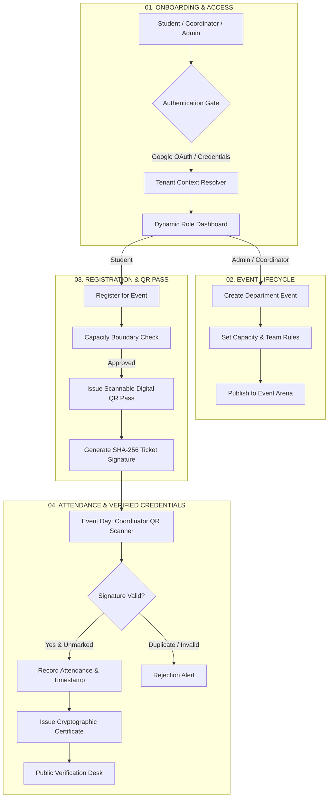
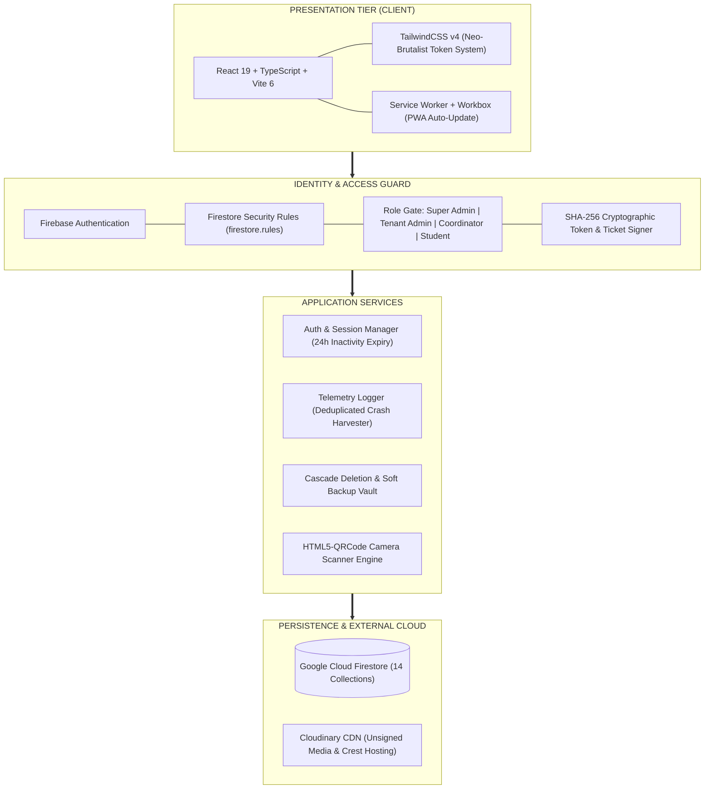
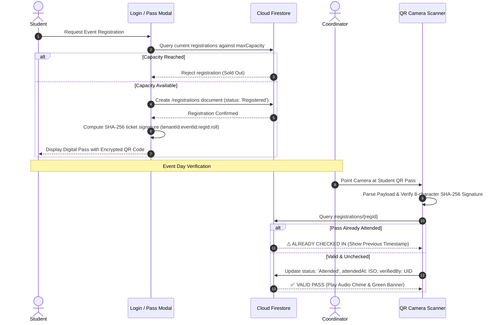
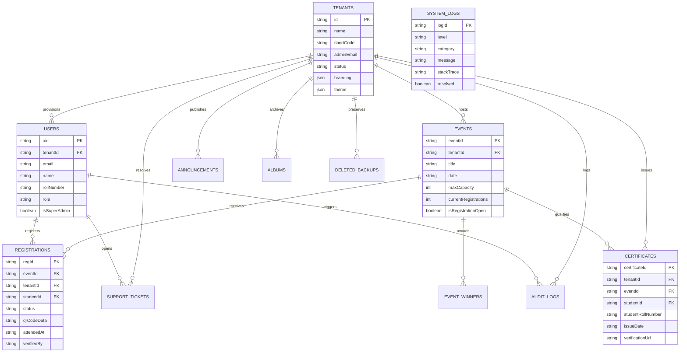

<div align="center">

<pre>
███╗   ██╗ ██████╗ ████████╗██╗  ██╗
████╗  ██║██╔═══██╗╚══██╔══╝╚██╗██╔╝
██╔██╗ ██║██║   ██║   ██║    ╚███╔╝
██║╚██╗██║██║   ██║   ██║    ██╔██╗
██║ ╚████║╚██████╔╝   ██║   ██╔╝ ██╗
╚═╝  ╚═══╝ ╚═════╝    ╚═╝   ╚═╝  ╚═╝
</pre>

<h3>⚡ MULTI-TENANT ACADEMIC ASSOCIATION OPERATING SYSTEM ⚡</h3>

<p>
<b>High-Performance Campus Event Management • Cryptographic QR Passes • Digital Credentials Desk • Zero-Loss Safety Vault</b>
</p>

</div>

---

[](https://react.dev/)
[](https://www.typescriptlang.org/)
[](https://vitejs.dev/)
[](https://tailwindcss.com/)
[](https://firebase.google.com/)
[](https://vite-pwa-org.netlify.app/)
[](LICENSE)

<br/>

```text
┌────────────────────────────────────────────────────────────────────────┐
│  LIVE DEMO: https://notx-saas.vercel.app/                              │
│  SOURCE:    https://github.com/ThinkBotz/notx-saas.git                 │
│  DESIGN:    Neo-Brutalist Industrial Design System                     │
└────────────────────────────────────────────────────────────────────────┘
```

</div>

---

## 📌 TABLE OF CONTENTS

```text
01 — SYSTEM SNAPSHOT           07 — DATABASE & ENTITY MODEL
02 — CORE CAPABILITIES         08 — TECHNOLOGY STACK
03 — HOW IT WORKS              09 — PROJECT TOPOLOGY
04 — SYSTEM ARCHITECTURE       10 — ENTERPRISE SECURITY & RBAC
05 — DATA FLOW & VERIFICATION  11 — 5-STEP LOCAL SETUP
06 — ROLE PERMISSION MATRIX    12 — TEST SUITES & HARNESSES
                               13 — TEAM & PLATFORM BUILDERS
```

---

## 01 — SYSTEM SNAPSHOT

<table width="100%">
<tr>
<td width="33%" valign="top">

### 🎯 PURPOSE
Enterprise-grade multi-tenant operating system for collegiate departments, academic clubs, and student associations. Eliminates manual attendance sheets and unverified paper certificates.

</td>
<td width="33%" valign="top">

### 🏢 TENANT ISOLATION
Logical multi-tenant isolation via Firestore security rules. Each tenant operates with dedicated branding, custom accent themes, autonomous event quotas, and isolated user registries.

</td>
<td width="33%" valign="top">

### 🔐 AUTH & VERIFICATION
Hybrid authentication (Firebase Auth + Salted SHA-256 credential hashing) combined with HMAC-style 8-character cryptographic ticket signatures for spoof-proof QR validation.

</td>
</tr>
<tr>
<td valign="top">

### 💾 DATA PERSISTENCE
Cloud Firestore real-time database structured across 14 collections. Features zero-loss soft deletion with a dedicated `deleted_backups` safety vault for instant cascade restoration.

</td>
<td valign="top">

### 📱 PROGRESSIVE WEB APP
Native installability on iOS (*Safari Share → Add to Home Screen*) and Android/Chromium. Offline error queuing, automatic service worker updates, and install prompts.

</td>
<td valign="top">

### 🛡️ TELEMETRY & AUDIT
Centralized client crash logging (`system_logs`) with client environment fingerprints, alongside an immutable enterprise activity ledger (`audit_logs`) tracking administrative operations.

</td>
</tr>
</table>

---

## 02 — CORE CAPABILITIES

```text
╔═══════════════════════════════════════════════════════════════════════════════════════════════════╗
║                                   PLATFORM FUNCTIONAL MATRIX                                      ║
╚═══════════════════════════════════════════════════════════════════════════════════════════════════╝
```

| MODULE | CAPABILITY | IMPLEMENTATION DETAIL |
| :--- | :--- | :--- |
| **🏢 Multi-Tenant Engine** | Dynamic Tenant Workspaces | Master platform branding (`NOTX`) with autonomous tenant instances (e.g. `CSE-AIML`, `ECE`, `MECH`). Tenant customizers support presets (`Cobalt Tech`, `Cyber Gold`, `Emerald Forge`, `Royal Violet`, `Crimson Riot`, `Aqua Nexus`). |
| **🎟️ Digital Event Arena** | Atomic Event Registration | Team and solo registrations with concurrency cap enforcement. Automated generation of scannable QR passes containing roll number, registration ID, and cryptographic signature. |
| **📷 High-Speed QR Scanner** | Real-Time Attendance Check-In | Built-in camera scanner via `html5-qrcode`. Instant validation against Firestore with duplicate-scan prevention and live sound/haptic feedback. |
| **🎓 Digital Credentials Desk** | Public Certificate Verification | Custom certificate templates with automated variable interpolation (`{eventTitle}`, `{eventDate}`, signatory titles). Public unauthenticated verification endpoint by Certificate ID. |
| **🏆 Wall of Champions** | Podium & Awards Showcase | Visual leaderboard honoring 1st, 2nd, and 3rd place winners, team rosters, project links, and commemorative prize media. |
| **📢 Department Circulars** | Categorized Bulletin Board | Markdown-formatted official notifications tagged by `Exam`, `Workshop`, `Result`, `Notice`, and `News`. Supports multi-image attachments via Cloudinary. |
| **💬 Student P2P Messaging** | Real-Time Collaboration Hub | In-app messaging threads between authenticated students with project collaboration requests and coordinator contact channels. |
| **🗄️ Zero-Loss Safety Vault** | Cascade Recovery System | Deleting an event or tenant stages all dependent records (registrations, certificates, winners) inside `deleted_backups`. Super Admins can restore or permanently purge at any time. |
| **🩺 Global Diagnostics** | Centralized Crash Telemetry | Global error boundary and unhandled promise interceptors log stack traces, browser runtime details, and tenant context directly into Firestore for real-time debugging. |

---

## 03 — HOW IT WORKS



---

## 04 — SYSTEM ARCHITECTURE



---

## 05 — DATA FLOW & VERIFICATION



---

## 06 — ROLE PERMISSION MATRIX

```text
┌────────────────────────────────────────────────────────────────────────────────────────┐
│  SUPER ADMIN  : Full sovereignty across all tenants, backups, logs & system config     │
│  TENANT ADMIN : Full management of their specific department workspace & coordinators │
│  COORDINATOR  : Event management, QR pass scanning, and attendee check-in               │
│  STUDENT      : Event registration, pass wallet, messaging, and ticket submission      │
└────────────────────────────────────────────────────────────────────────────────────────┘
```

| OPERATION / PERMISSION | SUPER ADMIN | TENANT ADMIN | COORDINATOR | STUDENT / MEMBER | PUBLIC |
| :--- | :---: | :---: | :---: | :---: | :---: |
| **Create & Delete Tenants** | ✅ | ❌ | ❌ | ❌ | ❌ |
| **Configure Platform Branding** | ✅ | ❌ | ❌ | ❌ | ❌ |
| **Purge / Restore Safety Vault** | ✅ | ❌ | ❌ | ❌ | ❌ |
| **View System Crash Diagnostics** | ✅ | ❌ | ❌ | ❌ | ❌ |
| **Edit Department Theme / Branding** | ✅ | ✅ | ❌ | ❌ | ❌ |
| **Create & Manage Events** | ✅ | ✅ | ✅ | ❌ | ❌ |
| **Scan QR Passes & Mark Attendance** | ✅ | ✅ | ✅ | ❌ *(tamper-blocked)* | ❌ |
| **Issue Verified Certificates** | ✅ | ✅ | ❌ | ❌ | ❌ |
| **Verify Certificate by ID** | ✅ | ✅ | ✅ | ✅ | ✅ |
| **Publish Department Announcements** | ✅ | ✅ | ✅ | ❌ | ❌ |
| **Register for Events & Get Passes** | ✅ | ✅ | ✅ | ✅ | ❌ |
| **Submit Helpdesk Support Tickets** | ✅ | ✅ | ✅ | ✅ | ✅ *(pre-auth)* |

---

## 07 — DATABASE & ENTITY MODEL

The backend is built on **Google Cloud Firestore** featuring 14 distinct collections bounded by server-side security rules:



---

## 08 — TECHNOLOGY STACK

```text
┌──────────────────────────────────────────────────────────────────────────────────┐
│  TIER            TECHNOLOGY           VERSION         ROLE                       │
├──────────────────────────────────────────────────────────────────────────────────┤
│  Runtime         React                19.0.1          Component Architecture     │
│  Language        TypeScript           5.8.2           End-to-End Type Safety     │
│  Build Tool      Vite                 6.2.3           HMR & Bundle Pipeline      │
│  Styling         TailwindCSS          4.1.14          Modern Utility CSS Engine  │
│  Icons           Lucide React         0.546.0         Vector Icon System         │
│  Motion          Framer Motion / GSAP 12.23 / 3.15    Physics & UI Animations    │
│  Scanning        HTML5-QRCode         2.3.8           Mobile Camera QR Decoder   │
│  Database        Cloud Firestore      12.15.0         NoSQL Document Database    │
│  Authentication  Firebase Auth        12.15.0         OAuth & Credential Guard   │
│  Media           Cloudinary SDK       REST / Direct   Unsigned Image Hosting     │
│  Offline / PWA   Vite Plugin PWA      1.3.0           Service Worker & Cache     │
│  Execution       TSX                  4.21.0          TypeScript Shell Runner    │
└──────────────────────────────────────────────────────────────────────────────────┘
```

---

## 09 — PROJECT TOPOLOGY

```text
notx-saas/
│
├── 📂 public/                         # Static assets & PWA manifest
│   ├── favicon.ico
│   ├── icon.svg                       # Master vector brand crest
│   ├── pwa-192x192.png                # PWA mobile app launcher
│   └── pwa-512x512.png                # PWA high-res splash graphic
│
├── 📂 scripts/                        # Automated testing & operational harnesses
│   ├── test-saas-lifecycle.ts         # 8-step complete lifecycle validation
│   ├── test-concurrency-scale.ts      # 4-tenant, 400-student concurrency stress
│   ├── clean-sweep-db.ts              # Zero-residue database purge utility
│   └── inspect-db.ts                  # Firestore schema inspection utility
│
├── 📂 src/
│   ├── 📂 components/                 # View controllers & modal dialogs
│   │   ├── SuperAdminDashboard.tsx    # Master platform control plane & logs
│   │   ├── AdminPanelView.tsx         # Tenant administration console
│   │   ├── DashboardView.tsx          # Student primary landing dashboard
│   │   ├── EventsView.tsx             # Interactive event discovery arena
│   │   ├── EventTicketModal.tsx       # Scannable cryptographic QR ticket
│   │   ├── QRCameraScanner.tsx        # Camera-based event check-in scanner
│   │   ├── CertificateCard.tsx        # Digital credential display component
│   │   ├── CertificateVerificationModal.tsx # Public certificate verification
│   │   ├── AnnouncementsView.tsx      # Markdown department circulars
│   │   ├── GalleryView.tsx            # Lightbox memory album gallery
│   │   ├── MembersView.tsx            # Student & coordinator directory
│   │   ├── ContactView.tsx            # Department helpdesk & ticket desk
│   │   ├── ProfileView.tsx            # Student digital identity card & pass wallet
│   │   └── BrandLogo.tsx              # Adaptive brand crest & typography
│   │
│   ├── 📂 services/
│   │   └── logger.ts                  # Crash harvester & offline error sync
│   │
│   ├── 📂 utils/
│   │   ├── auth.ts                    # Salted SHA-256 hasher & ticket signer
│   │   ├── themePresets.ts            # 7 Neo-Brutalist tenant color themes
│   │   └── testTenantSecurity.ts      # Automated tenant boundary assertions
│   │
│   ├── App.tsx                        # Master routing, tenant state & layout
│   ├── firebase.ts                    # 110KB+ comprehensive Firestore data layer
│   ├── index.css                      # Neo-Brutalist CSS tokens & keyframes
│   ├── main.tsx                       # React root & global window crash traps
│   └── types.ts                       # Complete domain TypeScript contracts
│
├── firestore.rules                    # 236 lines of declarative security rules
├── package.json                       # Dependencies & CLI scripts
├── tsconfig.json                      # Strict compiler settings
├── vercel.json                        # Single Page App URL rewrites
└── vite.config.ts                     # PWA workbox & Vite bundle configuration
```

---

## 10 — ENTERPRISE SECURITY & RBAC

```text
┏━━━━━━━━━━━━━━━━━━━━━━━━━━━━━━━━━━━━━━━━━━━━━━━━━━━━━━━━━━━━━━━━━━━━━━━━━━━━━━━━┓
║                     DEFENSE-IN-DEPTH SECURITY MODEL                            ║
┗━━━━━━━━━━━━━━━━━━━━━━━━━━━━━━━━━━━━━━━━━━━━━━━━━━━━━━━━━━━━━━━━━━━━━━━━━━━━━━━━┛
```

| SECURITY LAYER | ENFORCEMENT MECHANISM | MITIGATION SUMMARY |
| :--- | :--- | :--- |
| **Tenant Isolation** | `firestore.rules` checking `resource.data.tenantId` | Cross-tenant data bleed is blocked at the database level. Students cannot read or mutate documents belonging to another department. |
| **Self-Elevation Guard** | Server-side role immutability checks | Users updating their profile cannot modify `role` or `isSuperAdmin`. Elevating privileges requires authenticated Super Admin authorization. |
| **Attendance Forgery Guard** | Tamper-proof registration rule | Students can update registration details (e.g. team members) but are blocked from setting `status: 'Attended'` or altering verification metadata. |
| **Ticket Counterfeiting** | Salted SHA-256 HMAC Signature | Each QR pass contains an 8-character cryptographic hash computed over `tenantId + eventId + regId + rollNumber`. Altered QR payloads fail coordinator verification. |
| **Credential Safety** | Web Crypto SHA-256 with System Salt | Passwords are salted and hashed on the client before submission, with backward-compatible automated rehashing for legacy accounts. |
| **Session Inactivity** | 24-Hour Sliding Expiry | User activity is tracked in local storage. Inactivity exceeding 24 hours invalidates authentication tokens and purges sensitive session storage. |
| **Audit Trails** | Immutable `/audit_logs` collection | Critical administrative actions (role changes, tenant deletion, resets) generate an append-only audit record readable only by admins. |
| **Soft Delete Safety** | Zero-loss `/deleted_backups` collection | Deletions are captured with complete parent and cascade-child data payloads before removal from active collections. |

---

## 11 — 5-STEP LOCAL SETUP

```text
[ 01: CLONE ] ──→ [ 02: DEPS ] ──→ [ 03: ENV ] ──→ [ 04: DEV ] ──→ [ 05: BUILD ]
```

### 01. Clone Repository
```bash
git clone https://github.com/ThinkBotz/notx-saas.git
cd notx-saas
```

### 02. Install Dependencies
```bash
npm install
```

### 03. Configure Environment Variables
Create a `.env` file in the root directory:
```env
# Cloudinary Configuration for Image & Crest Uploads
VITE_CLOUDINARY_CLOUD_NAME=your_cloudinary_cloud_name
VITE_CLOUDINARY_UPLOAD_PRESET=your_unsigned_upload_preset
```

### 04. Run Local Development Server
```bash
npm run dev
```
Open **[http://localhost:3000](http://localhost:3000)** in your browser.

### 05. Validate Type Checking & Build
```bash
npm run lint    # Runs tsc --noEmit
npm run build   # Generates production bundle in dist/
```

---

## 12 — TEST SUITES & HARNESSES

The repository includes enterprise test harnesses executed in headless Node.js via `tsx`:

```text
┌────────────────────────────────────────────────────────────────────────┐
│  SUITE               COMMAND                    DESCRIPTION            │
├────────────────────────────────────────────────────────────────────────┤
│  Full Lifecycle      npm run test:saas          8-step SaaS audit      │
│  Concurrency Scale   npm run test:concurrency   400-student load test  │
│  Static Type Safety  npm run lint               Strict TypeScript run  │
└────────────────────────────────────────────────────────────────────────┘
```

<details>
<summary><strong>👉 CLICK TO EXPAND: Lifecycle Test Steps (test:saas)</strong></summary>

The `npm run test:saas` script executes the following sequential steps against the live database:
1. **Tenant Provisioning**: Creates an isolated sandbox tenant with custom theme and branding.
2. **Multi-Role User Provisioning**: Creates Super Admin, Tenant Admin, Coordinator, and Student accounts.
3. **Event Provisioning**: Creates capped department events with team registration parameters.
4. **Concurrency & Capacity Rules**: Validates atomic registrations and checks capacity limits.
5. **Cryptographic QR Signing**: Computes and validates SHA-256 signatures for attendee passes.
6. **Attendance Validation**: Simulates coordinator QR scan and records check-in timestamp.
7. **Certificate Issuance & Verification**: Issues a participation certificate and performs unauthenticated verification by ID.
8. **Cascade Teardown & Sweep**: Tests soft deletion into safety vault and performs zero-residue cleanup.

</details>

<details>
<summary><strong>👉 CLICK TO EXPAND: Concurrency & Multi-Tenant Boundary Suite (test:concurrency)</strong></summary>

The `npm run test:concurrency` script performs stress testing:
- **4 Simultaneous Tenants**: Simulates concurrent operations across `CSE`, `ECE`, `MECH`, and `CIVIL`.
- **400 Chunked User Writes**: Seeds 100 students per tenant using atomic Firestore write batches.
- **Cross-Tenant Boundary Injection**: Attempts foreign tenant registration injection and asserts rejection.
- **Race Condition Verification**: Sends 100 simultaneous registration requests against a 50-capacity event to verify overbooking prevention.
- **High-Speed Check-In Benchmark**: Benchmarks QR signature verification speed and validates attendance recording.
- **Complete Cascade Teardown**: Cleans all test records and verifies zero orphaned documents.

</details>

---

## 13 — TEAM & PLATFORM BUILDERS

<table width="100%">
<tr>
<td width="33%" align="center">
<br/>
<b>SYED SAMEER</b><br/>
<code>23HM1A3354</code><br/>
<b>Lead Full-Stack Architect</b><br/>
<sub>Initiated project concept, designed multi-tenant architecture, real-time database schema, QR verification engine & credentials desk.</sub><br/><br/>
<a href="mailto:syedsame2244@gmail.com">📧 Email</a> • <a href="https://github.com/samxiao0">🐙 GitHub</a>
<br/><br/>
</td>
<td width="33%" align="center">
<br/>
<b>SYED NASEER</b><br/>
<code>24HM5A3305</code><br/>
<b>Technical Strategist</b><br/>
<sub>Led feature requirement specifications, workflow planning, coordinator permission structures & technical strategy.</sub><br/><br/>
<a href="https://github.com">🐙 GitHub</a> • <a href="https://linkedin.com">💼 LinkedIn</a>
<br/><br/>
</td>
<td width="33%" align="center">
<br/>
<b>K BHANU</b><br/>
<code>24HM5A3302</code><br/>
<b>Frontend Engineer</b><br/>
<sub>Developed UI components, event registration cards, certificates modal & mobile navigation docks.</sub><br/><br/>
<a href="https://github.com">🐙 GitHub</a> • <a href="https://linkedin.com">💼 LinkedIn</a>
<br/><br/>
</td>
</tr>
</table>

---

## 14 — LICENSE

Distributed under the **MIT License**. See `LICENSE` for more information.

```text
Copyright (c) 2026 NOTX Ecosystem / Department of CSE (AI & ML)
Permission is hereby granted, free of charge, to any person obtaining a copy
of this software and associated documentation files (the "Software"), to deal
in the Software without restriction...
```

<div align="center">
  <sub>Engineered with ⚡ for collegiate innovation and academic excellence.</sub>
</div>
