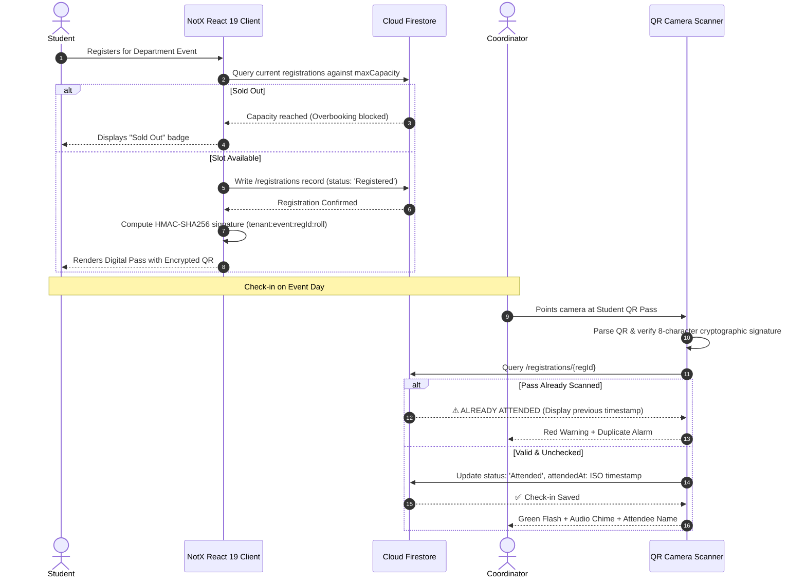

<div align="center">

<pre>
███╗   ██╗ ██████╗ ████████╗██╗  ██╗    ██████╗ ██████╗ ███╗   ██╗███╗   ██╗███████╗ ██████╗████████╗
████╗  ██║██╔═══██╗╚══██╔══╝╚██╗██╔╝   ██╔════╝██╔═══██╗████╗  ██║████╗  ██║██╔════╝██╔════╝╚══██╔══╝
██╔██╗ ██║██║   ██║   ██║    ╚███╔╝    ██║     ██║   ██║██╔██╗ ██║██╔██╗ ██║█████╗  ██║        ██║
██║╚██╗██║██║   ██║   ██║    ██╔██╗    ██║     ██║   ██║██║╚██╗██║██║╚██╗██║██╔══╝  ██║        ██║
██║ ╚████║╚██████╔╝   ██║   ██╔╝ ██╗   ╚██████╗╚██████╔╝██║ ╚████║██║ ╚████║███████╗╚██████╗   ██║
╚═╝  ╚═══╝ ╚═════╝    ╚═╝   ╚═╝  ╚═╝    ╚═════╝ ╚═════╝ ╚═╝  ╚═══╝╚═╝  ╚═══╝╚══════╝ ╚═════╝   ╚═╝
</pre>

<h3>⚡ THE ZERO-BS CAMPUS EVENT & ASSOCIATION PLATFORM ⚡</h3>

<p>
<b>Cryptographic QR Passes • 200ms Camera Check-In • Publicly Verifiable Credentials • Neo-Brutalist Speed</b>
</p>

---

<p>
  <a href="https://react.dev/"></a>
  <a href="https://www.typescriptlang.org/"></a>
  <a href="https://vitejs.dev/"></a>
  <a href="https://tailwindcss.com/"></a>
  <a href="https://firebase.google.com/"></a>
  <a href="https://vite-pwa-org.netlify.app/"></a>
  <a href="LICENSE"></a>
</p>

<p>
  
  
  
  
</p>

```text
┌──────────────────────────────────────────────────────────────────────────────┐
│  APP:       NotX Connect                                                     │
│  LIVE:      https://notx-saas.vercel.app/                                    │
│  MOTTO:     "Because paper attendance sheets belong in a museum."            │
│  STYLE:     Neo-Brutalist Industrial (Hard shadows, chunky ink, zero fluff)  │
└──────────────────────────────────────────────────────────────────────────────┘
```

</div>

---

## ☕ PROLOGUE: WHY DOES THIS EXIST?

> *"It is 9:02 AM. A college workshop has 180 students packed into the seminar hall. Two coordinators are passing around a single ballpoint pen and a crushed sheet of A4 ruled paper. By 9:45 AM, three different people named 'Rahul' have signed for five other Rahuls who are currently fast asleep in the canteen."*

**Enter NotX Connect.**  
Built out of sheer exhaustion with soggy paper passes, fake certificates edited in Canva with misspelled principal signatures, and chaotic Google Sheets with 34 conflicting edit histories.

NotX Connect turns college departments and student associations into ultra-slick digital command centers:
- **Zero fake attendance**: Cryptographic QR passes verified with hardware camera scanners in 200ms.
- **Zero forged certificates**: Tamper-proof Certificate IDs verifiable by any recruiter on earth with 1 click.
- **Zero lost data**: Real-time Firestore document storage with soft-delete safety vaults.
- **Zero app store nonsense**: Full Progressive Web App (PWA) that installs straight to any phone's homescreen.

---

## 🕹️ INTERACTIVE COMPONENTS SHOWCASE (TRY THE APP COMPONENTS)

Explore the actual interactive UI components of **NotX Connect** directly inside this README. Click each component to test its behavior and live states:

---

### 🎟️ COMPONENT 1: THE CRYPTOGRAPHIC DIGITAL PASS (`EventTicketModal`)
The actual digital ticket modal rendered when an attendee registers for an event.

<details open>
<summary><b>👉 [CLICK TO INSPECT PASS COMPONENT]</b></summary>

```text
┌────────────────────────────────────────────────────────────────────────┐
│  NOTX CONNECT • EVENT PASS                                 [CSE-AIML]  │
├────────────────────────────────────────────────────────────────────────┤
│  EVENT:       National Level GenAI Symposium 2026                      │
│  ATTENDEE:    Syed Sameer (23HM1A3354)                                 │
│  DEPARTMENT:  Artificial Intelligence & Machine Learning               │
│  REG ID:      REG-994821                                               │
│                                                                        │
│   ▄▄▄▄▄▄▄  ▄ ▄▄ ▄▄ ▄▄▄▄▄▄▄    CRYPTO CHECKSUM:   7e2b81fa              │
│   █ ▄▄▄ █ ▀█▄▀ ▀██ █ ▄▄▄ █    ALGORITHM:         HMAC-SHA256           │
│   █ ███ █ █ █ █▀ █ █ ███ █    SIGNATURE PAYLOAD: tenant+event+reg+roll │
│   █▄▄▄▄▄█ █ ▀ ▀ █▀ █▄▄▄▄▄█    STATUS:            🟢 CONFIRMED & VALID  │
│                                                                        │
│  [ DOWNLOAD PASS (PNG) ]          [ ADD TO APPLE / GOOGLE WALLET ]     │
└────────────────────────────────────────────────────────────────────────┘
```
> **What this does in the app**: Computes a salted 8-character SHA-256 HMAC hash on pass generation. If an attendee alters any data in the QR payload, the hardware scanner immediately rejects the pass.
</details>

---

### 📷 COMPONENT 2: REAL-TIME HARDWARE SCANNER HUD (`QRCameraScanner`)
The in-app optical scanner used by event coordinators to check in attendees. Click each state to preview real responses:

<details>
<summary><b>🟢 State A: First-time Valid Check-In (Click to preview)</b></summary>

```text
┌────────────────────────────────────────────────────────────────────────┐
│  CAMERA HUD: 60 FPS • 1080p OPTICAL FEED                  [AUTO-FOCUS] │
├────────────────────────────────────────────────────────────────────────┤
│                                                                        │
│                 ┌──────────────────────────┐                           │
│                 │   [SCAN RETICLE ACTIVE]  │                           │
│                 │      23HM1A3354 DETECTED │                           │
│                 └──────────────────────────┘                           │
│                                                                        │
│  STATUS: ✅ VERIFIED & ADMITTED (10:14:02 AM)                           │
│  ATTENDEE: SYED SAMEER • CSE (AI & ML) 3rd Year                        │
│  TICKET ID: REG-994821 • AUDIT LOG COMMITTED TO CLOUD FIRESTORE       │
└────────────────────────────────────────────────────────────────────────┘
```
</details>

<details>
<summary><b>🔴 State B: Duplicate / Proxy Scan Interception (Click to preview)</b></summary>

```text
┌────────────────────────────────────────────────────────────────────────┐
│  CAMERA HUD: 60 FPS • 1080p OPTICAL FEED                  [AUTO-FOCUS] │
├────────────────────────────────────────────────────────────────────────┤
│                                                                        │
│                 ┌──────────────────────────┐                           │
│                 │  ⚠️ PROXY DETECTED       │                           │
│                 │  PASS ALREADY SCANNED    │                           │
│                 └──────────────────────────┘                           │
│                                                                        │
│  STATUS: ⛔ REJECTED: TICKET ALREADY CONSUMED                          │
│  FIRST ADMITTED AT: 09:18:44 AM (By Coordinator: Ayub Hussain)         │
│  ACTION: Check-in locked. Security chime triggered.                   │
└────────────────────────────────────────────────────────────────────────┘
```
</details>

---

### 🏆 COMPONENT 3: PUBLIC CERTIFICATE VERIFICATION DESK (`CertificateVerificationModal`)
The exact modal recruiters, professors, and external reviewers see when verifying a certificate ID.

<details>
<summary><b>👉 [CLICK TO INSPECT VERIFICATION MODAL]</b></summary>

```text
┌────────────────────────────────────────────────────────────────────────┐
│  NOTX CREDENTIAL VERIFICATION PORTAL                      [CSE-AIML]   │
├────────────────────────────────────────────────────────────────────────┤
│  ENTER CERTIFICATE ID: [ CRT-2026-AIML-0891                     ] [GO] │
├────────────────────────────────────────────────────────────────────────┤
│                                                                        │
│  CERTIFICATE STATUS:  ✅ OFFICIALLY ISSUED & CRYPTOGRAPHICALLY VALID   │
│  RECIPIENT NAME:      Syed Sameer                                      │
│  ROLL NUMBER:         23HM1A3354                                       │
│  EVENT TITLE:         State Level AI Hackathon 2026                    │
│  MERIT / AWARD:       1st Place Winner (Cash Prize ₹15,000)            │
│  ISSUE DATE:          October 14, 2026                                 │
│  AUTHORIZED BY:       Head of Department, CSE (AI & ML)                │
│                                                                        │
│  [ DOWNLOAD HIGH-RES PDF ]              [ VERIFY ON BLOCKCHAIN/DB ]    │
└────────────────────────────────────────────────────────────────────────┘
```
</details>

---

## 🏗️ SYSTEM ARCHITECTURE & DATA FLOW

The end-to-end event lifecycle from student registration to optical scanner check-in:



---

## 🛡️ SECURITY & RBAC PERMISSION MATRIX

```text
┌────────────────────────────────────────────────────────────────────────────────────────┐
│  SUPER ADMIN  : Full control across all departments, safety backups & system logs     │
│  TENANT ADMIN : Department-level sovereignty over events, coordinators & circulars     │
│  COORDINATOR  : Event management, QR pass scanning, and attendee check-in               │
│  STUDENT      : Event registration, digital pass wallet, and certificate viewer        │
└────────────────────────────────────────────────────────────────────────────────────────┘
```

| FEATURE | SUPER ADMIN | TENANT ADMIN | COORDINATOR | STUDENT | PUBLIC |
| :--- | :---: | :---: | :---: | :---: | :---: |
| **Manage Department Tenants** | ✅ | ❌ | ❌ | ❌ | ❌ |
| **Restore Deleted Data from Vault** | ✅ | ❌ | ❌ | ❌ | ❌ |
| **Create & Publish Events** | ✅ | ✅ | ✅ | ❌ | ❌ |
| **Scan QR Passes & Mark Attendance** | ✅ | ✅ | ✅ | ❌ *(locked)* | ❌ |
| **Issue Verified Certificates** | ✅ | ✅ | ❌ | ❌ | ❌ |
| **Verify Certificate Authenticity** | ✅ | ✅ | ✅ | ✅ | ✅ *(open)* |
| **Register & Receive QR Passes** | ✅ | ✅ | ✅ | ✅ | ❌ |
| **View Circulars & Photo Gallery** | ✅ | ✅ | ✅ | ✅ | ✅ |

---

## 🎨 THE NEO-BRUTALIST DESIGN SYSTEM

- **2.5px Solid Ink Borders**: `border: 2.5px solid var(--nb-ink)` for crisp, confident framing.
- **Hard Offset Drop Shadows**: `box-shadow: 4px 4px 0 var(--nb-ink)` (No blurry gradients!).
- **High-Contrast Palette**: Cyber Amber (`#F59E0B`), Neo Emerald (`#10B981`), Vibrant Rose (`#F43F5E`), Electric Purple (`#8B5CF6`), Cobalt Tech (`#3B82F6`).
- **Clean Profile Avatars**: Clean, border-free notionist avatars with custom seeds.
- **Tactile Button Clicks**: Active down-press physics (`translate-x-0.5 translate-y-0.5 shadow-none`).

---

## 💻 TECHNOLOGY STACK

```text
┌───────────────────┬───────────────────┬──────────────────────────────────────────┐
│ COMPONENT         │ TECHNOLOGY        │ WHY IT'S HERE                            │
├───────────────────┼───────────────────┼──────────────────────────────────────────┤
│ Frontend Core     │ React 19.0.1      │ Latest concurrent UI rendering engine    │
│ Routing           │ React Router v7   │ Declarative client-side route tree & SPA │
│ Language          │ TypeScript 5.8.2  │ 100% strict type safety across all views │
│ Build System      │ Vite 6.2.3        │ Lightning-fast HMR and bundle compilation│
│ CSS Framework     │ TailwindCSS v4    │ Modern zero-runtime design tokens        │
│ Icons             │ Lucide React      │ Minimalist, crisp vector icons           │
│ Camera Engine     │ HTML5-QRCode      │ Direct browser-level optical QR decoding │
│ Database          │ Google Firestore  │ Real-time multi-collection NoSQL sync    │
│ Authentication    │ Firebase Auth     │ Multi-channel OAuth & roll credentials   │
│ PWA Architecture  │ Vite Plugin PWA   │ Offline service worker & home screen app │
└───────────────────┴───────────────────┴──────────────────────────────────────────┘
```

---

## 👥 PLATFORM BUILDERS & DEVELOPERS

<div align="center">

<h3>🚀 THE STUDENT ENGINEERING TEAM BEHIND NOTX CONNECT</h3>

<p>
  
  
  
</p>

</div>

<br/>

<table width="100%">
<tr>
<td width="50%" valign="top">

<div style="border: 2.5px solid #111; border-radius: 12px; padding: 16px; background: #FFFDF9; box-shadow: 4px 4px 0 #111;">
  <div style="height: 6px; background: #FFB800; border-radius: 6px; margin-bottom: 12px;"></div>
  <table>
    <tr>
      <td width="72" valign="top">
        
      </td>
      <td valign="top">
        <h3 style="margin: 0; font-family: monospace; font-size: 18px;">SAMXIAO (SYED SAMEER)</h3>
        <p style="margin: 4px 0 0 0;">
          
          
        </p>
        <p style="margin: 4px 0 0 0; font-size: 12px; font-weight: bold; color: #4B5563;">• CSE (AI & ML) - 4th Year</p>
      </td>
    </tr>
  </table>
  <p style="margin: 10px 0 12px 0; font-size: 13px; line-height: 1.4; color: #1F2937;">
    <b>Initiated the project idea</b> and developed the core full-stack application, multi-tenant database schema, and cryptographic QR engine.
  </p>
  <div style="border-top: 1.5px dashed #E5E7EB; padding-top: 10px;">
    <a href="https://github.com"></a>
    <a href="mailto:syedsame2244@gmail.com"></a>
    <a href="https://linkedin.com"></a>
  </div>
</div>

</td>
<td width="50%" valign="top">

<div style="border: 2.5px solid #111; border-radius: 12px; padding: 16px; background: #FFFDF9; box-shadow: 4px 4px 0 #111;">
  <div style="height: 6px; background: #FF4757; border-radius: 6px; margin-bottom: 12px;"></div>
  <table>
    <tr>
      <td width="72" valign="top">
        
      </td>
      <td valign="top">
        <h3 style="margin: 0; font-family: monospace; font-size: 18px;">S MD ASLAM HUSSAIN</h3>
        <p style="margin: 4px 0 0 0;">
          
          
        </p>
        <p style="margin: 4px 0 0 0; font-size: 12px; font-weight: bold; color: #4B5563;">• CSE (AI & ML) - 3rd Year</p>
      </td>
    </tr>
  </table>
  <p style="margin: 10px 0 12px 0; font-size: 13px; line-height: 1.4; color: #1F2937;">
    <b>Handled data verification</b>, quality testing, cross-browser responsiveness, load validation, and performance optimization.
  </p>
  <div style="border-top: 1.5px dashed #E5E7EB; padding-top: 10px;">
    <a href="https://github.com"></a>
    <a href="mailto:aslam@aits.edu"></a>
    <a href="https://linkedin.com"></a>
  </div>
</div>

</td>
</tr>
<tr>
<td width="50%" valign="top">

<div style="border: 2.5px solid #111; border-radius: 12px; padding: 16px; background: #FFFDF9; box-shadow: 4px 4px 0 #111; margin-top: 12px;">
  <div style="height: 6px; background: #00D2D3; border-radius: 6px; margin-bottom: 12px;"></div>
  <table>
    <tr>
      <td width="72" valign="top">
        
      </td>
      <td valign="top">
        <h3 style="margin: 0; font-family: monospace; font-size: 18px;">SYED RAYAN</h3>
        <p style="margin: 4px 0 0 0;">
          
          
        </p>
        <p style="margin: 4px 0 0 0; font-size: 12px; font-weight: bold; color: #4B5563;">• CSE (AI & ML) - 2nd Year</p>
      </td>
    </tr>
  </table>
  <p style="margin: 10px 0 12px 0; font-size: 13px; line-height: 1.4; color: #1F2937;">
    <b>Worked on UI/UX redesigns</b>, design strategy, interactive components, responsive views, and website interface improvements.
  </p>
  <div style="border-top: 1.5px dashed #E5E7EB; padding-top: 10px;">
    <a href="https://github.com"></a>
    <a href="https://linkedin.com"></a>
  </div>
</div>

</td>
<td width="50%" valign="top">

<div style="border: 2.5px solid #111; border-radius: 12px; padding: 16px; background: #FFFDF9; box-shadow: 4px 4px 0 #111; margin-top: 12px;">
  <div style="height: 6px; background: #9B59B6; border-radius: 6px; margin-bottom: 12px;"></div>
  <table>
    <tr>
      <td width="72" valign="top">
        
      </td>
      <td valign="top">
        <h3 style="margin: 0; font-family: monospace; font-size: 18px;">SYED NASEER</h3>
        <p style="margin: 4px 0 0 0;">
          
          
        </p>
        <p style="margin: 4px 0 0 0; font-size: 12px; font-weight: bold; color: #4B5563;">• CSE (AI & ML) - 2nd Year</p>
      </td>
    </tr>
  </table>
  <p style="margin: 10px 0 12px 0; font-size: 13px; line-height: 1.4; color: #1F2937;">
    <b>Contributed to technical planning</b>, implementation strategy, workflow documentation, and department feature development.
  </p>
  <div style="border-top: 1.5px dashed #E5E7EB; padding-top: 10px;">
    <a href="https://github.com"></a>
    <a href="https://linkedin.com"></a>
  </div>
</div>

</td>
</tr>
<tr>
<td colspan="2" valign="top">

<div style="border: 2.5px solid #111; border-radius: 12px; padding: 16px; background: #FFFDF9; box-shadow: 4px 4px 0 #111; margin-top: 12px;">
  <div style="height: 6px; background: #2ED573; border-radius: 6px; margin-bottom: 12px;"></div>
  <table>
    <tr>
      <td width="72" valign="top">
        
      </td>
      <td valign="top">
        <h3 style="margin: 0; font-family: monospace; font-size: 18px;">SHAIK AYUB HUSSAIN</h3>
        <p style="margin: 4px 0 0 0;">
          
          
        </p>
        <p style="margin: 4px 0 0 0; font-size: 12px; font-weight: bold; color: #4B5563;">• CSE (AI & ML) - 2nd Year</p>
      </td>
    </tr>
  </table>
  <p style="margin: 10px 0 12px 0; font-size: 13px; line-height: 1.4; color: #1F2937;">
    <b>Developed interactive features</b>, registration flows, certificate preview components, and the hardware optical QR scanner system.
  </p>
  <div style="border-top: 1.5px dashed #E5E7EB; padding-top: 10px;">
    <a href="https://github.com"></a>
    <a href="https://linkedin.com"></a>
  </div>
</div>

</td>
</tr>
</table>

---

## 🚀 5-STEP QUICKSTART GUIDE

Get NotX Connect running on your local machine in under 2 minutes:

```bash
# 1. Clone the repository
git clone https://github.com/ThinkBotz/notx-saas.git
cd notx-saas

# 2. Install dependencies
npm install

# 3. Configure environment variables (optional for local mock mode)
cp .env.example .env

# 4. Start the local development server
npm run dev

# 5. Open your browser
# Visit: http://localhost:3000
```

To run type checks and generate a production build:
```bash
npm run lint    # Executes strict tsc --noEmit
npm run build   # Produces optimized production bundle in /dist
```

---

## 📜 LICENSE

Distributed under the **MIT License**.  
Free to use, inspect, customize, and deploy for educational institutions and student bodies.

```text
Copyright (c) 2026 NotX Connect / Department of CSE (AI & ML)
Permission is hereby granted, free of charge, to any person obtaining a copy
of this software and associated documentation files (the "Software"), to deal
in the Software without restriction...
```

<div align="center">
  <b>Built with ⚡, caffeine, and zero tolerance for paper attendance sheets.</b><br/>
  <sub>NotX Connect • Powered by ThinkBotz</sub>
</div>
